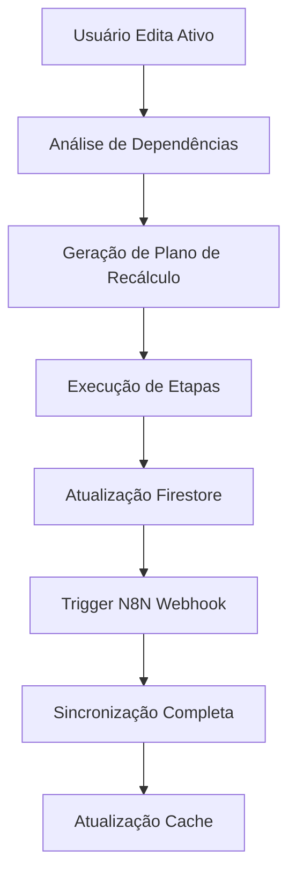

# Sistema Avançado de Recálculo com Integração N8N

## 🎯 Visão Geral

O Sistema Avançado de Recálculo foi desenvolvido para resolver o desafio de recalcular automaticamente todos os valores dependentes quando um ativo base é editado no painel de auditoria. O sistema integra com o fluxo N8N existente e gerencia as dependências complexas entre os ativos.

## 🏗️ Arquitetura

### Componentes Principais

1. **`dependency-service.ts`** - Mapeia dependências entre ativos
2. **`advanced-recalculation-service.ts`** - Executa recálculos com integração N8N
3. **`recalculation-progress.tsx`** - Interface visual de progresso
4. **Painel de Auditoria** - Interface do usuário atualizada

### Fluxo de Dados



## 🔧 Configuração

### Variáveis de Ambiente

Adicione ao seu arquivo `.env.local`:

```bash
# URL base do N8N (opcional)
N8N_WEBHOOK_URL=https://seu-n8n-instance.com/webhook

# Configurações de timeout (opcional)
RECALCULATION_TIMEOUT=30000
```

### Configuração do N8N

O sistema espera um webhook N8N no endpoint:
```
POST /webhook/reprocessar-ucs
```

**Payload esperado:**
```json
{
  "data_referencia": "2025-10-02",
  "ajustes_manuais": {
    "milho": 65.51,
    "soja": 22.33
  },
  "salvar_historico": true,
  "origem": "painel_auditoria"
}
```

## 📊 Mapeamento de Dependências

### Ativos Base (Editáveis)
- **USD/BRL** - Dólar Comercial
- **EUR/BRL** - Euro
- **Soja** - Depende do USD para conversão
- **Milho** - Independente
- **Boi Gordo** - Independente  
- **Carbono** - Depende do EUR para conversão
- **Madeira** - Depende do USD para conversão

### Índices Calculados (Automáticos)
- **CH2O Água** - Depende de: Boi, Milho, Soja, Madeira, Carbono
- **Custo_Água** - Depende de: CH2O Água
- **PDM** - Depende de: CH2O Água + Custo_Água
- **UCS** - Depende de: PDM
- **UCS ASE** - Depende de: UCS + USD + EUR
- **VUS** - Depende de: Boi, Milho, Soja
- **Carbono_CRS** - Depende de: Carbono
- **Agua_CRS** - Depende de: CH2O Água
- **Vmad** - Depende de: Madeira
- **Valor_Uso_Solo** - Depende de: VUS + Vmad + Carbono_CRS + Agua_CRS

## 🚀 Como Usar

### 1. Editando Ativos

1. Acesse o painel de auditoria
2. Clique no botão de edição (📝) ao lado do ativo desejado
3. Insira o novo valor
4. O sistema mostrará automaticamente quantos ativos serão afetados

### 2. Executando Recálculo

1. Clique em **"Salvar e Recalcular"**
2. Escolha entre:
   - **🚀 Recálculo Avançado** (Recomendado)
     - Integração automática com N8N
     - Mapeamento completo de dependências
     - Progresso detalhado em tempo real
     - Validação avançada de dados
   - **🔧 Recálculo Tradicional**
     - Método original sem integração N8N

3. Acompanhe o progresso em tempo real

### 3. Monitoramento

O sistema fornece:
- **Progresso em tempo real** com etapas detalhadas
- **Estimativa de tempo** baseada na complexidade
- **Status de cada etapa** (Pendente, Em Progresso, Concluído, Erro)
- **Informações de dependência** para cada ativo
- **Logs de auditoria** completos

## 🔍 Exemplo Prático

**Cenário:** Editar o preço do Milho de R$ 65,00 para R$ 70,00

**Ativos Afetados Automaticamente:**
1. **Milho** - Rentabilidade média recalculada
2. **CH2O Água** - Componente milho (30%) atualizado
3. **Custo_Água** - Baseado no CH2O Água
4. **PDM** - Soma CH2O + Custo_Água
5. **UCS** - Baseado no PDM
6. **UCS ASE** - Baseado no UCS
7. **VUS** - Componente milho (30%) atualizado
8. **Valor_Uso_Solo** - Inclui VUS atualizado

**Tempo Estimado:** ~8 segundos
**N8N Trigger:** Automático (se configurado)

## 🛠️ Fórmulas de Cálculo

### Rentabilidades Médias
```javascript
// Boi Gordo
rent_media = preco * 18

// Milho  
rent_media = (preco / 60) * 1000 * 7.20

// Soja
rent_media = ((preco / 60) * 1000) * cotacao_usd * 3.3

// Carbono
rent_media = preco * cotacao_eur * 2.59

// Madeira
madeira_tora_usd = preco * 0.375620342
madeira_tora_brl = madeira_tora_usd * cotacao_usd
rent_media = madeira_tora_brl * 1196.54547720813 * 0.10
```

### Índices Principais
```javascript
// CH2O Água
ch2o = (rent_boi * 0.35) + (rent_milho * 0.30) + (rent_soja * 0.35) + rent_madeira + rent_carbono

// VUS
componente_boi = (rent_boi * 25) * 0.35
componente_milho = (rent_milho * 25) * 0.30  
componente_soja = (rent_soja * 25) * 0.35
soma = componente_boi + componente_milho + componente_soja
vus = soma - (soma * 0.048) // Desconto arrendamento

// PDM
pdm = ch2o + custo_agua

// UCS
ucs = (pdm / 900) / 2
```

## 🔧 Troubleshooting

### Problemas Comuns

**1. N8N não responde**
- Verifique se `N8N_WEBHOOK_URL` está configurado
- Teste o webhook manualmente
- O sistema continuará funcionando sem N8N

**2. Recálculo lento**
- Use o modo tradicional para testes
- Verifique conexão com Firestore
- Monitore logs do console

**3. Dependências incorretas**
- Verifique o mapeamento em `ASSET_DEPENDENCIES`
- Confirme se as fórmulas estão corretas
- Teste com valores conhecidos

### Logs e Debug

```javascript
// Ativar logs detalhados
console.log('[Advanced Recalc] Iniciando recálculo...');
console.log('[N8N Trigger] Payload:', payload);
console.log('[Dependency] Ativos afetados:', affectedAssets);
```

## 🚀 Próximos Passos

1. **Configurar N8N** com o webhook apropriado
2. **Testar** com dados reais em ambiente de desenvolvimento
3. **Monitorar** performance em produção
4. **Expandir** para outros tipos de ativos conforme necessário

## 📞 Suporte

Para dúvidas ou problemas:
1. Verifique os logs do console do navegador
2. Confirme configurações de ambiente
3. Teste o webhook N8N independentemente
4. Consulte a documentação do Firestore para problemas de conectividade

---

**Desenvolvido com integração total ao fluxo N8N existente** 🔄✨
