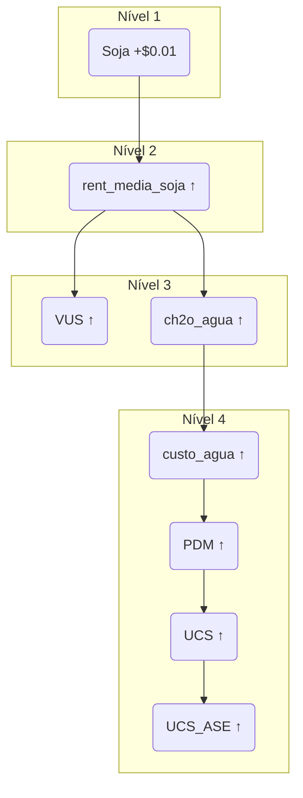

# 📋 VISÃO GERAL DO SISTEMA
Este documento define todas as fórmulas matemáticas do sistema UCS, desde os ativos base até o índice final (ucs_ase). Cada cálculo é implementado no n8n e pode ser reprocessado via sistema de cache.

# 🏗️ HIERARQUIA DE CÁLCULO (4 NÍVEIS)
## 📊 DIAGRAMA DA CASCATA


**NÍVEL 1: Ativos Base (Editáveis)**
     ↓
**NÍVEL 2: Rentabilidades Médias (BRL/ha)**  
     ↓
**NÍVEL 3: Índices de Composição (VUS, VMAD, CRS)**
     ↓
**NÍVEL 4: Índices Finais (PDM → UCS → UCS_ASE)**

---

# 🎯 NÍVEL 1: ATIVOS BASE (EDITÁVEIS)
Valores de entrada do sistema - **ÚNICOS** editáveis manualmente.

| Ativo       | Moeda | Descrição                 |
|-------------|-------|---------------------------|
| `soja`      | USD   | Futuro da saca de 60kg    |
| `milho`     | BRL   | Futuro da saca de 60kg    |
| `boi_gordo` | BRL   | Preço da arroba           |
| `madeira`   | USD   | Futuro da madeira serrada |
| `carbono`   | EUR   | Crédito de carbono        |
| `usd`       | BRL   | Cotação USD/BRL           |
| `eur`       | BRL   | Cotação EUR/BRL           |
| `Agua_CRS`  | BRL   | Valor derivado (calculado)|

---

# 🧮 NÍVEL 2: RENTABILIDADES MÉDIAS (BRL/HA)

### FÓRMULA: Rentabilidade Soja
```javascript
// Converte soja USD → BRL/ha
const sojaBRL = soja * usd;
const toneladaBRL = ((sojaBRL / 60) * 1000) + 0.01990;
const rent_media_soja = toneladaBRL * 3.3;
```

### FÓRMULA: Rentabilidade Milho
```javascript
// Milho já em BRL
const toneladaBRL = (milho / 60) * 1000;
const rent_media_milho = toneladaBRL * 7.20;
```

### FÓRMULA: Rentabilidade Boi Gordo
```javascript
// Aplicação direta do fator
const rent_media_boi = boi_gordo * 18;
```

### FÓRMULA: Rentabilidade Madeira
```javascript
// Converte madeira USD → BRL/ha
const madeira_tora_usd = madeira * 0.375620342;
const madeira_tora_brl = (madeira_tora_usd * usd) + 0.02;
const rent_media_madeira = madeira_tora_brl * 1196.54547720813 * 0.10;
```

### FÓRMULA: Rentabilidade Carbono
```javascript
// Converte carbono EUR → BRL/ha
const carbonoBRL = carbono * eur;
const rent_media_carbono = carbonoBRL * 2.59;
```

---

# 📈 NÍVEL 3: ÍNDICES DE COMPOSIÇÃO

### FÓRMULA: VUS (Valor de Uso do Solo)
```javascript
// Soma ponderada das commodities
const soma_ponderada = 
  (rent_media_boi * 0.35) + 
  (rent_media_milho * 0.30) + 
  (rent_media_soja * 0.35);

// Aplica desconto de arrendamento 4.8% e multiplicador
const vus = soma_ponderada * (1 - 0.048) * 25;
```

### FÓRMULA: VMAD (Valor da Madeira)
```javascript
const vmad = rent_media_madeira * 5;
```

### FÓRMULA: Carbono CRS
```javascript
const carbono_crs = rent_media_carbono * 25;
```

### FÓRMULA: CH2O Água (Intermediário)
```javascript
const ch2o_agua = 
  (rent_media_boi * 0.35) + 
  (rent_media_milho * 0.30) + 
  (rent_media_soja * 0.35) + 
  rent_media_madeira + 
  rent_media_carbono;
```
---

# 🚀 NÍVEL 4: ÍNDICES FINAIS (CASCATA)

### FÓRMULA: Custo Água
```javascript
const custo_agua = ch2o_agua * 0.07;
```

### FÓRMULA: PDM (Potencial Desflorestador Monetizado)
```javascript
const pdm = ch2o_agua + custo_agua;
```

### FÓRMULA: UCS (Unidade de Crédito de Sustentabilidade)
```javascript
const ucs = (pdm / 900) / 2;
```

### FÓRMULA: UCS ASE (Índice Final)
```javascript
const ucs_ase = ucs * 2;

// CONVERSÕES FINAIS:
const ucs_ase_usd = ucs_ase / usd;
const ucs_ase_eur = ucs_ase / eur;
```

---

# 🔄 SISTEMA DE REPROCESSAMENTO NO n8n
Lógica principal do nó "Calcular UCS Completo".

```javascript
// Nó: "Calcular UCS Completo"
try {
  // 1. BUSCAR DADOS BASE (do cache ou fresh)
  const dados = await buscarDadosBase();
  
  // 2. CALCULAR RENTABILIDADES (Nível 2)
  const rentabilidades = {
    soja: calcularRentabilidadeSoja(dados.soja, dados.usd),
    milho: calcularRentabilidadeMilho(dados.milho),
    boi_gordo: calcularRentabilidadeBoi(dados.boi_gordo),
    madeira: calcularRentabilidadeMadeira(dados.madeira, dados.usd),
    carbono: calcularRentabilidadeCarbono(dados.carbono, dados.eur)
  };
  
  // 3. CALCULAR ÍNDICES COMPOSTOS (Nível 3)
  const indices = {
    vus: calcularVUS(rentabilidades),
    vmad: calcularVMAD(rentabilidades.madeira),
    carbono_crs: calcularCarbonoCRS(rentabilidades.carbono),
    ch2o_agua: calcularCH2OAgua(rentabilidades)
  };
  
  // 4. CALCULAR CASCATA FINAL (Nível 4)
  const resultados = {
    custo_agua: indices.ch2o_agua * 0.07,
    pdm: indices.ch2o_agua + (indices.ch2o_agua * 0.07),
    ucs: ((indices.ch2o_agua + (indices.ch2o_agua * 0.07)) / 900) / 2,
    ucs_ase: (((indices.ch2o_agua + (indices.ch2o_agua * 0.07)) / 900) / 2) * 2
  };
  
  // 5. SALVAR RESULTADOS
  await salvarResultadosFirebase(resultados);
  
  return [{ json: resultados }];
  
} catch (error) {
  return [{ json: { erro: error.message } }];
}
```

### EXEMPLO DE IMPACTO EM CASCATA
**Cenário:** Preço da `soja` aumenta em `$0.01`.



### Código de Simulação de Impacto:
```javascript
// Nó: "Simular Impacto"
const simularImpacto = (ativo, novoValor) => {
  // 1. Calcular situação atual
  const resultadosAtuais = calcularUCSCascata(dadosAtuais);
  
  // 2. Aplicar alteração
  const dadosSimulados = { ...dadosAtuais, [ativo]: novoValor };
  const resultadosSimulados = calcularUCSCascata(dadosSimulados);
  
  // 3. Calcular diferenças
  const impactos = {};
  Object.keys(resultadosAtuais).forEach(key => {
    impactos[key] = {
      atual: resultadosAtuais[key],
      novo: resultadosSimulados[key],
      diferenca: resultadosSimulados[key] - resultadosAtuais[key],
      variacao_percentual: ((resultadosSimulados[key] - resultadosAtuais[key]) / resultadosAtuais[key]) * 100
    };
  });
  
  return impactos;
};
```

---

# 🔧 CONFIGURAÇÃO NO n8n
Constantes e Fatores armazenados em um nó de configuração para fácil ajuste.

```javascript
// Nó: "Configuração UCS"
const CONFIG = {
  fatores_rentabilidade: {
    soja: 3.3,
    milho: 7.20,
    boi_gordo: 18,
    madeira: 1196.54547720813,
    carbono: 2.59
  },
  pesos_vus: {
    boi: 0.35,
    milho: 0.30,
    soja: 0.35
  },
  multiplicadores: {
    vus: 25,
    vmad: 5,
    carbono_crs: 25,
    ucs_ase: 2
  },
  outros: {
    desconto_arrendamento: 0.048,
    percentual_agua: 0.07,
    divisor_ucs: 900
  }
};
```
---

# 📊 SAÍDAS DO SISTEMA
Exemplo da estrutura JSON salva no Firebase após o cálculo completo.

```javascript
{
  "data_calculo": "2025-10-02",
  "rentabilidades": {
    "soja": 1239.73,
    "milho": 2358.36,
    "boi_gordo": 1933.79,
    "madeira": 146763.32,
    "carbono": 1239.73
  },
  "indices_intermediarios": {
    "vus": 156694.86,
    "vmad": 733816.60,
    "carbono_crs": 30993.18,
    "ch2o_agua": 152583.21
  },
  "indices_finais": {
    "custo_agua": 10680.82,
    "pdm": 163264.03,
    "ucs": 90.70,
    "ucs_ase": 181.40
  },
  "timestamp": "2025-10-02T10:00:00Z"
}
```

---

# 🚨 REGRAS DE ARREDONDAMENTO
**Padrão do Sistema:**
- **Rentabilidades:** 2 casas decimais
- **Índices Intermediários:** 2 casas decimais
- **Índices Finais:** 2 casas decimais
- **UCS_ASE:** 2 casas decimais

**Exemplo no Código:**
```javascript
// Usar truncamento (não arredondamento) para bater com Excel
const truncar = (valor, casas = 2) => Math.floor(valor * Math.pow(10, casas)) / Math.pow(10, casas);
```
