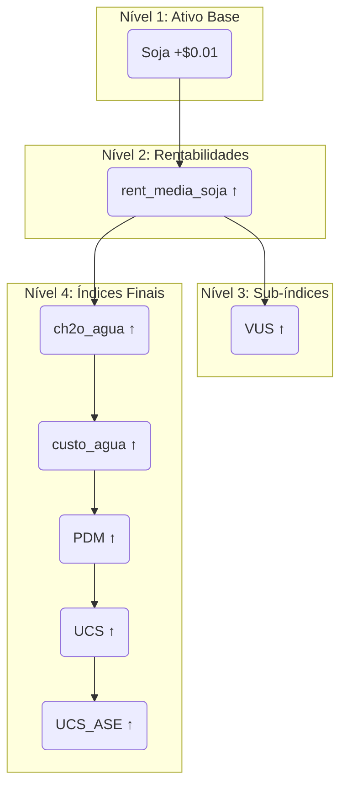

# Guia Detalhado de Fórmulas e Cascata de Cálculo

## 1. Visão Geral

Este documento serve como a fonte da verdade para todas as fórmulas de cálculo usadas na plataforma do Índice UCS. O objetivo é fornecer transparência total sobre como os valores são derivados, desde os ativos base até o índice final (`ucs_ase`), e ilustrar o "efeito cascata" que uma alteração em um único ativo pode causar em todo o sistema.

As fórmulas aqui descritas são baseadas no fluxo de trabalho original do N8N e foram replicadas no arquivo `src/lib/real-calculation-service.ts` para permitir simulações precisas em tempo real no painel de auditoria.

## 2. Hierarquia de Cálculo

O sistema é estruturado em uma hierarquia de 4 níveis. Uma alteração em um nível superior sempre se propaga para os níveis inferiores.

### Nível 1: Ativos Base (Editáveis)

Estes são os valores de entrada do sistema, geralmente obtidos de fontes de mercado (ex: `investing.com`). São os únicos valores que um administrador pode editar manualmente na página de Auditoria.

*   **Soja (`soja`):** Preço do futuro da saca de 60kg em **Dólar (USD)**.
*   **Milho (`milho`):** Preço do futuro da saca de 60kg em **Real (BRL)**.
*   **Boi Gordo (`boi_gordo`):** Preço da arroba em **Real (BRL)**.
*   **Madeira (`madeira`):** Preço do futuro da madeira serrada em **Dólar (USD)**.
*   **Carbono (`carbono`):** Preço do crédito de carbono em **Euro (EUR)**.
*   **Dólar (`usd`):** Cotação da moeda USD/BRL.
*   **Euro (`eur`):** Cotação da moeda EUR/BRL.
*   **Água CRS (`Agua_CRS`):** Ativo tratado como base, mas seu valor é derivado.

### Nível 2: Rentabilidades Médias (Cálculos Intermediários)

Esta é a primeira e mais crucial camada de cálculo. Seu objetivo é normalizar os diferentes ativos base para uma unidade de medida comum e comparável: **Reais (BRL) por Hectare**.

#### Fórmula: Rentabilidade Média da Soja
Transforma o preço da saca de soja em USD para BRL/ha.
```
// 1. Converte preço da saca para BRL
sojaBRL = preco_soja_usd * cotacao_dolar

// 2. Converte preço da saca para preço por tonelada (com ajuste fino)
toneladaBRL = ((sojaBRL / 60) * 1000) + 0.01990

// 3. Aplica fator de rentabilidade (toneladas por hectare)
rent_media_soja = toneladaBRL * 3.3
```

#### Fórmula: Rentabilidade Média do Milho
Transforma o preço da saca de milho em BRL para BRL/ha.
```
// 1. Converte preço da saca para preço por tonelada
toneladaBRL = (preco_milho_brl / 60) * 1000

// 2. Aplica fator de rentabilidade
rent_media_milho = toneladaBRL * 7.20
```

#### Fórmula: Rentabilidade Média do Boi Gordo
Transforma o preço da arroba em BRL para BRL/ha.
```
// Aplica fator de rentabilidade direto
rent_media_boi = preco_boi_brl * 18
```

#### Fórmula: Rentabilidade Média da Madeira
Transforma o preço do futuro de madeira em USD para BRL/ha.
```
// 1. Converte preço para "madeira tora" em USD e depois em BRL (com ajuste fino)
madeira_tora_usd = preco_madeira_usd * 0.375620342
madeira_tora_brl = (madeira_tora_usd * cotacao_dolar) + 0.02

// 2. Aplica fator de rentabilidade e percentual
rent_media_madeira = madeira_tora_brl * 1196.54547720813 * 0.10
```

#### Fórmula: Rentabilidade Média do Carbono
Transforma o preço do crédito de carbono em EUR para BRL/ha.
```
// 1. Converte preço para BRL
carbonoBRL = preco_carbono_eur * cotacao_euro

// 2. Aplica fator de rentabilidade
rent_media_carbono = carbonoBRL * 2.59
```

### Nível 3: Índices de Composição (Sub-índices)

Estes índices agrupam as rentabilidades médias para criar os primeiros indicadores de valor.

#### Fórmula: VUS (Valor de Uso do Solo)
Agrega as rentabilidades das commodities agrícolas.
```
// 1. Soma ponderada das rentabilidades multiplicadas por 25
soma_componentes = (rent_media_boi * 25 * 0.35) + (rent_media_milho * 25 * 0.30) + (rent_media_soja * 25 * 0.35)

// 2. Aplica desconto de arrendamento de 4.8%
vus = soma_componentes * (1 - 0.048)
```

#### Fórmula: VMAD (Valor da Madeira)
Calcula o valor da madeira.
```
vmad = rent_media_madeira * 5
```

#### Fórmula: Carbono CRS
Calcula o valor do Custo de Responsabilidade Socioambiental para Carbono.
```
carbono_crs = rent_media_carbono * 25
```

### Nível 4: Índices Finais (Cascata Principal)

Esta é a sequência final de cálculos que leva ao índice principal da plataforma. Cada índice depende do anterior.

#### Fórmula: CH2O Água
Soma ponderada das rentabilidades para calcular o valor da água.
```
ch2o_agua = (rent_media_boi * 0.35) + (rent_media_milho * 0.30) + (rent_media_soja * 0.35) + rent_media_madeira + rent_media_carbono
```
*Nota: Este é um cálculo intermediário para os próximos índices.*

#### Fórmula: Custo Água
Representa 7% do valor do `ch2o_agua`.
```
custo_agua = ch2o_agua * 0.07
```

#### Fórmula: PDM (Potencial Desflorestador Monetizado)
Soma os componentes de rentabilidade e o custo da água.
```
pdm = ch2o_agua + custo_agua
```

#### Fórmula: UCS (Unidade de Crédito de Sustentabilidade)
Normaliza o valor do PDM.
```
ucs = (pdm / 900) / 2
```

#### Fórmula: UCS ASE (Índice Final)
Índice final da plataforma, aplicando um multiplicador ao UCS.
```
ucs_ase = ucs * 2
```
*Este valor final é então convertido para USD e EUR para exibição.*

## 3. A Cascata de Impacto: Um Exemplo Prático

Para entender como uma pequena mudança se propaga, vamos usar o exemplo de uma alteração no preço da **Soja (USD)**.

**Cenário:** O preço da `soja` aumenta em `$0.01`.



**Explicação da Cascata:**

1.  **Edição do Ativo Base (`soja`):** O administrador edita o preço da soja.
2.  **Impacto na Rentabilidade (`rent_media_soja`):** A alteração afeta diretamente o Passo 1 da fórmula da soja, que por sua vez aumenta o valor da `rent_media_soja`.
3.  **Impacto nos Sub-índices:**
    *   **`VUS`:** Como o `VUS` depende diretamente da `rent_media_soja` (com peso de 35%), seu valor também aumenta.
4.  **Impacto nos Índices Finais:**
    *   **`ch2o_agua`:** Este índice também usa `rent_media_soja` em sua fórmula, então seu valor sobe.
    *   **`custo_agua`:** Como este é 7% do `ch2o_agua`, ele também sobe.
    *   **`PDM`:** Sendo a soma de `ch2o_agua` e `custo_agua`, o PDM aumenta.
    *   **`UCS`:** Derivado do `PDM`, o `ucs` também aumenta.
    *   **`UCS_ASE`:** Sendo o dobro do `ucs`, o índice final também é impactado, e suas versões em USD e EUR são recalculadas.

Este exemplo ilustra como o sistema é interconectado. Uma alteração em **qualquer** ativo base (`usd`, `eur`, `milho`, etc.) iniciará uma cascata semelhante, afetando todos os índices que dependem dele, direta ou indiretamente. O painel de "Análise de Impacto" na ferramenta de auditoria foi projetado para simular e exibir exatamente essa cascata antes de salvar qualquer alteração.
